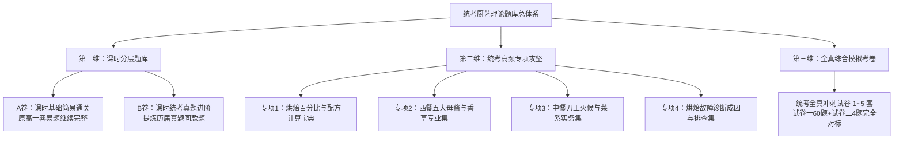

# 2020-2025 年马来西亚华文独中统考《厨艺理论与实务》(SY26) 历届考题深度剖析与 AI 命题提示词规范

> **工程定位**：统考考情全面解密、双轨命题标准、Prompt 资产库与复习路线图  
> **数据来源**：2020、2021、2022、2023、2024、2025 年共 6 年真实独中统考试卷（全 66 页高精数字化分析）  
> **学科代号**：高中厨艺科《厨艺理论与实务》(SY26)  

---

## 第一部分：2020-2025 历届考题全面解密与命题规律分析

### 1. 试卷标准规格与分值结构

马来西亚华文独中高中统考《厨艺理论与实务》为全科综合性专业考试，分为两大部分：

| 试卷构成 | 题型与题量 | 分值占比 | 考试时长 | 考查结构与作答规则 |
| :--- | :--- | :--- | :--- | :--- |
| **试卷一（选择题）** | 60 题单选题（四选一） | **60%** (60分) | 1 小时 20 分钟 (80分钟) | **60 题全答**。<br>• **甲组 烘焙理论与实务**：第 1~40 题 (40分/占66.7%)<br>• **乙组 西餐烹调艺术及实践**：第 41~50 题 (10分/占16.7%)<br>• **丙组 亚洲烹调艺术及实践**：第 51~60 题 (10分/占16.7%) |
| **试卷二（作答题）** | 综合问答/计算/案例分析 | **40%** (40分) | 1 小时 20 分钟 (80分钟) | **共作答 4 题完卷**。<br>• **甲组 必答题**：1 题必答 (10分/占25%)<br>• **乙组 选答题**：7 题中**任选 3 题** (每题10分，共30分/占75%) |

---

### 2. 试卷一（选择题）命题特征与核心考点分布

#### (1) 甲组：烘焙理论与实务（第 1~40 题，占 40 分）—— 绝对重头戏
* **原辅料功能与物化特性**：高筋粉/低筋粉蛋白质含量与吸水率（高粉62%~66%）、灰分定义；糖吸湿性与保鲜；油脂起酥性、乳化性；蛋白打发起泡原理与酸度调节（塔塔粉/柠檬汁）；酵母分类与换算（快速干酵母用量为新鲜酵母的 1/3）。
* **烘焙机械与设备用具**：烤炉演变（古埃及人发明最早烤炉）、搅拌机三款拌打器（勾状/桨状/球状）、烤盘容积计算公式（长×宽×高 / 底面积×高）、发酵箱温湿度。
* **烘焙工艺与成型**：搅拌六阶段、基本发酵与中间发酵（醒面）、滚圆目的、最后发酵条件、分割机效率计算。
* **烘焙故障诊断与实务处理**：海绵蛋糕过度收缩、吐司表皮过厚、面包体积过小、饼干边缘焦糊挽救、烤炉不满盘放湿报纸/湿白纸调节。

#### (2) 乙组：西餐烹调艺术及实践（第 41~50 题，占 10 分）
* **西餐酱汁系统**：五大母酱（White Stock + White Roux = Velouté；Brown Roux + Brown Stock = Espagnole 等）、荷兰酱油脂（澄清奶油）。
* **西餐经典菜式与高汤**：法式洋葱汤（深色成因焦糖化与专用术语）、马赛鱼汤、匈牙利牛肉汤盛饰（酸奶油 Sour Cream）、维希冷汤。
* **食材处理与烹调手法**：水波煮（Poaching 65~80℃）、蒸气蒸、牛排生熟度（Rare、Medium Rare、Medium、Well Done）、香草与调味料（罗勒、百里香、迷迭香、鱼子酱）。

#### (3) 丙组：亚洲烹调艺术及实践（第 51~60 题，占 10 分）
* **中餐刀工**：直切、推切、拉切、滚刀切、剞刀、条与丝/丁与粒的尺寸界定。
* **火候与烹调方法**：白烧与红烧差别、炸/爆/烧/煮/煨/炖的区别、油温分级（旺火热油、中火温油）。
* **调味与菜系特色**：川菜七滋八味、八大菜系代表菜、调味料功能。
* **食品安全与卫生**：食品危险温度带（5℃~60℃）、砧板四色管理（红肉、蓝海鲜、绿蔬果、白熟食）、个人卫生与细菌预防（金黄色葡萄球菌与手指伤口）。

---

### 3. 试卷二（作答题）历年规律与命题模型

#### (1) 甲组（10分必答题）历年考题一览：
* **2020 年**：裹粉炸物裹衣程序（Breaded 3步：面粉 → 蛋液 → 面包糠）。
* **2021 年**：西餐专有名词释义（Paprika 辣椒粉、Salami 萨拉米香肠、Striped sandwich 条纹三明治）。
* **2022 年**：辛香料与调味料的健康功能、调味料分类、影响菜肴风味的主客观因素。
* **2023 年**：世界三大菜系列举 + 川菜核心“七滋”（酸、甜、麻、辣、苦、香、咸）。
* **2024 年**：**烘焙配方计算题**（已知低粉重量 312g，按烘焙百分比重抄表格计算各原料克数与总重，写出计算公式）。
* **2025 年**：中餐常用调味料列出五项并说明其具体作用。

#### (2) 乙组（30分选答题，7 选 3）题型分布：
* **烘焙大题（常年占 2~3 题）**：
  - **必考点 A：烘焙配方与损耗计算**（如小餐包 20 个、每个 60g、损耗 5%，计算面粉与各项材料克重；理想水温与摩擦升温计算；新鲜酵母换算）。
  - **必考点 B：工艺与机理**（二次发酵法优缺点；蛋白起泡四阶段；梅纳反应定义；三大类蛋糕油脂含量与拌合法）。
  - **必考点 C：故障排查诊断**（面包/蛋糕表皮太厚成因；体积太小成因；收缩下陷成因）。
* **西餐大题（常年占 2 题）**：
  - **必考点 A：西餐香草与专业词汇中英对照**（如 Caviar、Foie gras、Lard、Parsley、Basil、Thyme 等）。
  - **必考点 B：牛肉部位图与熟度**（牛肉部位名称标注、牛排四种生熟度特征）。
  - **必考点 C：五大基本母酱与经典名菜**（酱汁三大组成、演变酱汁、烹调温度）。
* **中餐与餐饮实务大题（常年占 2 题）**：
  - **必考点 A：刀工定义与食材适用**（直切、推切、拉切、推拉切、滚刀切并各举一例）。
  - **必考点 B：八大菜系与火候**（菜系形成因素与代表菜色；掌握火候关键；选肉与新鲜鱼肉鉴别）。
  - **必考点 C：厨房安全卫生实务**（餐具洗涤标准流程；厨房卫生四大原则；砧板四色功能）。

---

## 第二部分：高一现有题目 vs 统考真题对比评估

### 1. 结构与模式对比

| 比较维度 | 之前的高一题目（如08新测验、800题） | 历届统考真题模式 (2020-2025) | 对比结论 |
| :--- | :--- | :--- | :--- |
| **知识覆盖范围** | 纯烘焙单课基础（高一第1~20课面粉、油脂、糖、蛋等原料与设备） | 全科大综合：**烘焙 67% + 西餐 16.5% + 中餐 16.5%** | 高一题库是“单课桩”，统考是“大综合” |
| **试卷一（选择题）** | 包含部分简易常识单选、罗马题、填空题；题目直接考概念记忆 | **纯 60 题单选题**；偏向实务应用、故障排查、物理化学机理与计算 | 统考题干更具情境化与实务性 |
| **试卷二（作答题）** | 单课概念简答、定义默写 | **综合大题（10分/题）**，含烘焙百分比实务计算、牛肉部位图、香草对照、工艺对比 | 统考大题要求高度结构化与定量计算能力 |
| **难度梯次** | 基础扫盲级（难度 0.2~0.5） | 统考毕业考核级（难度 0.5~0.8，阶梯明显） | 之前容易题适合打底，必须衔接进阶题 |

### 2. 核心结论与应对策略
1. **之前的高一容易选择题务必“继续完整保留”**：
   - 它是高一学生初学者建立学科信心、课后 100% 掌握基础概念的“第一道防线”。
   - 不能废弃，应归档为【基础通关 A 卷（课时同步）】。
2. **不能仅停留在容易选择题**：
   - 统考有大量**计算大题（烘焙百分比/理想水温/损耗率）**和**综合排查题**。学生如果只刷容易选择题，到了大考作答题将面临失分风险。

---

## 第三部分：教学与题库建设专业建议

### 建议：构建“双轨三维”题库矩阵（科学高效，不搞低效重复）

针对用户的提问：*“每个课多弄一份类似历届考题的考题？还是你有其它建议？”*  
**专业建议：不要每个课机械地做全套统考卷，而是采用“双轨三维”体系**：



1. **第一维：课时同步分层（每课保留 A 卷，新增 B 卷）**
   - **A 卷（基础夯实）**：原有简易选择题与概念巩固，确保课内基础不丢分。
   - **B 卷（真题进阶）**：从历届统考中提炼该课相关的高频考法，包含 10 题真题难度选择题 + 1~2 题真题同款作答题（如学面粉课时，引入高低粉吸水率计算与过度搅拌断筋排查）。
2. **第二维：统考大题四大专项突破（提分关键！）**
   - 针对历年必考、容易失分的模块，建立专题训练：
     * **专项 1：烘焙配方、得率与理想水温计算题专项**（历年大题必考，每年10分白送分）。
     * **专项 2：西餐香草中英对照、母酱配方与牛肉部位图专项**。
     * **专项 3：中餐经典刀工、火候技巧与八大菜系代表菜专项**。
     * **专项 4：烘焙失败原因分析（面包/蛋糕/饼干）排查专项**。
3. **第三维：全真统考模拟卷（模考实战）**
   - 严格按照试卷一 60 题（40烘+10西+10中）与试卷二 4 题（必答1+选答3）的真题规格进行全真模拟。

---

## 第四部分：AI 命题提示词标准规范（Prompt Templates）

### 提示词一：【统考标准试卷一·选择题命题提示词】

```markdown
你是一位深谙马来西亚华文独中高中统考（UEC）命题规律的资深高级教师，拥有20年《厨艺理论与实务》(SY26) 教学与阅卷经验。
请根据董总 2020-2025 年历届统考真题的命题风格与考纲规范，为指定单元或阶段命制一组高质量的【统考标准选择题】。

### 一、试卷定位与组卷规格
1. 【题型】：纯四选一单项选择题（A、B、C、D），答案唯一且无争议。
2. 【分值标准】：每题 1 分。
3. 【模块配比】：（若命制综合全卷，需满足：烘焙 40 题 + 西餐 10 题 + 亚洲中餐 10 题；若命制单课真题进阶卷，需产出 10~15 题高仿统考题）。
4. 【命题风格与考查维度】：
   - 拒绝死记硬背的低阶题，紧扣统考真题三大考法：
     ① 生产实务与工艺参数（温度、时间、比例、水分、容积计算）；
     ② 物理化学机理（蛋白质变性、面筋二硫键、乳化作用、焦糖化与梅纳反应）；
     ③ 烘焙/烹调故障排查诊断（如蛋糕收缩成因、面包体积不足、炸物回软等）。
5. 【语言与排版规范】：
   - 专业术语统一采用统考规范繁简/行业用语（附带规范英文/法文对照，如：梅纳反应 Maillard reaction、水波煮 Poaching、麸质 Gluten、面糊 Roux）。
   - 题干表述严谨通顺，选项长短相近，干扰项具备高度迷惑性。
   - 答案必须均匀分布（A/B/C/D 各占约 25%）。
   - 输出必须附带：【正确答案】、【统考考点剖析】、【各干扰项深度解析】。
```

---

### 提示词二：【统考标准试卷二·作答题命题提示词】

```markdown
你是一位深谙马来西亚华文独中高中统考（UEC）命题规律的资深高级教师，拥有20年《厨艺理论与实务》(SY26) 教学与阅卷经验。
请根据董总 2020-2025 年历届统考试卷二的真题题型、分值分布与评分标准，命制一组高质量的【统考标准作答题】。

### 一、作答题结构与题型分类
每道大题满分为 10 分，通常分为 (a)、(b)、(c) 小题，小题分值为 2%~5% 不等。大题类型必须涵盖以下统考高频模型之一：

1. 【模型 A：烘焙配方与工艺计算大题】（统考必考）：
   - 给出表格形式的配方百分比与已知面粉重量，要求重抄表格并计算各原料克重与面团总重；
   - 或考查烘焙损耗率（Dough Loss %）、出炉率、理想搅拌水温（摩擦升温、室温、粉温三者折算）。
2. 【模型 B：工艺原理与故障诊断大题】：
   - 针对烘焙（面包/海绵蛋糕/戚风蛋糕/泡芙）或中西烹调中出现的品质事故（表皮太厚、过度收缩、组织粗糙、炸物含油量过高）；
   - 要求考生依序写出工艺流程、判断打发阶段，并列出 3~5 项具体成因与纠正措施。
3. 【模型 C：西餐经典系统与中英对照大题】：
   - 考查西餐五大基本母酱（Mother Sauce）配方与衍生酱汁、经典西餐组合（如法式洋葱汤、维希汤、凯撒沙拉、佛罗伦斯鸡胸）；
   - 或考查牛肉部位图分割识别（10个部位标注）、西餐核心香草与食材中英对照（10项）。
4. 【模型 D：中餐刀工、火候与菜系实务大题】：
   - 考查中餐经典刀法（直切、推切、拉切、推拉切、滚刀切）定义、适用食材与代表菜例；
   - 考查八大菜系代表菜、火候定义与调味法则（如川菜味型）；
   - 或考查食品储存与厨房卫生四大原则、餐具洗涤标准流程、砧板四色管理。

### 二、输出格式与评分细则
- 题干后必须明确标注小题分值（例如：(3%)、(4%)、(10%)）。
- 必须提供对标统考评卷标准的【参考答案与评分细则】（按分给点，条理清晰）。
```

---

## 第五部分：接下来执行的具体任务路线图

| 阶段 | 核心任务 | 具体输出物 | 状态 |
| :--- | :--- | :--- | :---: |
| **阶段 1** | **历届真题全面剖析与命题提示词体系建立** | 《2020-2025历届统考深度剖析与命题提示词体系.md》及标准 Prompt 规范 | **本阶段已完成** |
| **阶段 2** | **高一题库架构优化：基础 A 卷完整化** | 梳理高一第01至20课现有容易选择题，补齐缺漏课时，保证课时基础通关题库 100% 完整 | **待启动** |
| **阶段 3** | **打造四大统考提分必考专项题库** | ① 烘焙计算与配方专项（含历届真题同款计算题及步进解析）<br>② 西餐五大母酱/香草/牛肉图专项<br>③ 中餐刀工/火候/菜系专项<br>④ 烘焙故障诊断专练 | **待启动** |
| **阶段 4** | **研制 2026 统考全真高仿真模拟试题卷** | 严格按 60 题选择题（40烘+10西+10中）+ 4 题作答题规格，研制第 1~3 套统考冲刺全真模拟卷（带评分标准） | **待启动** |
